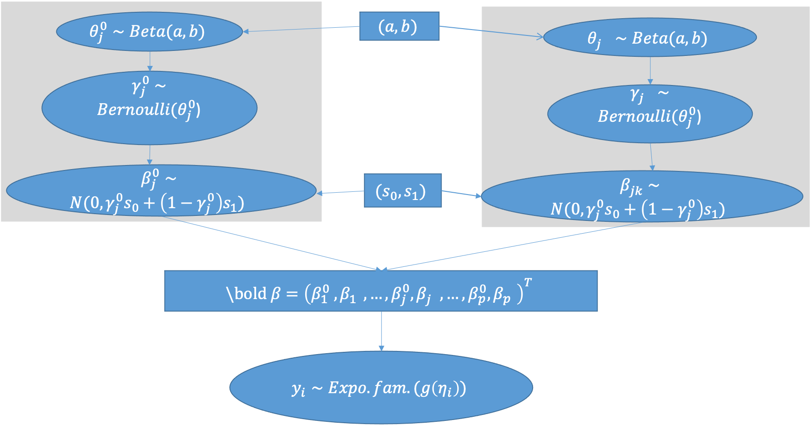

# Bayesian Hierarchical Additive Models
\label{sec:BHAM}

Following the GLM notation introduced in Section \ref{sec:intro}, we have a generalized additive model and its matrix form,
\begin{equation}\label{eq:gam}
E(Y|\bs x) = g^{-1}(a + \sum\limits^p_{j=1}f_j(x_j)) = g^{-1}(a + \sum\limits^p_{j=1} \bs \beta_j^T \bs X_j),
\end{equation}
with the smoothing function $f_j(x_j)$ of the variable $x_j, j = 1, \dots, p.$ The basis function matrix, i.e. the design matrix derived from the smoothing function $f_j(x_j)$, is denoted $\bs X_j$ for the variable $x_j$. The dimension of the design matrix depends on the choice of the smoothing function. For example, a cubic spline function with $k$ knots produces a $k+2$ elements column vector. Its corresponding smoothness penalty matrix is denoted as $\bs S_j$. $\bs \beta_j$ denotes the basis function coefficients for the $j$th variable, and the matrix transposing operation is denoted with a superscript $^T$. To note, the proposed model can include parametric forms of variables in the model, treating the parametric function as a special case of the smoothing function, e.g. $f_j(x_j) = x_j$ with the smoothness penalty matrix defined as $\bs S_j = \begin{bmatrix}0\end{bmatrix}$. 

To encourage proper smoothness of the smoothing functions, we adopt the idea of smoothing penalties from smoothing spline models. The basic idea is to set up a smoothing penalty, depending on the smoothness penalty matrix via Equation \ref{eq:smoothpen}, in the posterior density function, or least squared and likelihood function in the penalized framework. However, the direct integration of smoothness penalties into sparsity penalties is not obvious. Given the smoothness penalty matrix is most often symmetric and positive semi-definite ^[ we limit the discussion to univariate smoothing function. However, the penalty matrix could possibly contain multiple matrices, e.g. tensor product smoother.], it can be integrated into the design matrix $\bs X$ via a re-parameterization. The re-parameterization follows Marra and  Wood [@Marra2011], in which eigen-decomposed the penalty matrix $\bs S = \bs U \bs D \bs U^T$, where the matrix $\bs D$ is diagonal with the eigenvalues arranged in the ascending order. To note, $\bs D$ can contain $0$ elements on the diagonal, associated with the null space of the smooth function. We further write the orthonormal matrix $\bs U$, containing the eigenvectors as column, as an (row) augmentation of two sub-matrices $\bs U \equiv \begin{bmatrix}\bs U^0 : \bs U^{\text{pen}}\end{bmatrix}$, where $\bs U^{\text{pen}}$ contains the eigenvectors (as columns) for the non-zero eigenvalues, i.e. the penalized space, and $\bs U^0$ contains the eigenvectors for the null space. We multiply the basis function matrix $\bs X$ with the orthonormal matrix $\bs U$ for the new design matrix $\bs X^\ast = \bs X \bs U \equiv \begin{bmatrix} \bs X^0 : \bs X^{\text{pen}} \end{bmatrix}$. An additional scaling step is imposed on $\bs X^{\text{pen}}$ by the non-zero eigenvalues of $\bs D$ such that the new basis function matrix $\bs X^\ast$ is scale-invariant ^[ I know this work for tensor spline (see [@Wood2006]), but I am not sure if it can be generalized to all smoothing functions]. For notation convenience, we denote $\bs X_j \equiv \begin{bmatrix} \bs X_j^0 : \bs X_j^{\text{pen}} \end{bmatrix}$ as the after re-parameterized basis function matrix for the $j$th variable hereafter. Similarly, the spline function can be expressed in the matrix form
$$
f_j(x_j) = f_j^0(x_j) + f_j^\tp (x_j) = \bs {\beta_j^0}^T \bs X_j^0 + \bs {\beta_j^\tp}^T \bs X_j^\tp ,
$$
and the generalized additive model in Equation \ref{eq:gam} be
\begin{equation}\label{eq:gam-repa}
E(Y|\bs x) =  g^{-1}(a + \sum\limits^p_{j=1} \bs \beta_j^T \bs X_j) = g^{-1}\left[a + \sum\limits^p_{j=1} ({\beta_j^0}^T \bs X_j^0 + {\beta_j^\tp}^T \bs X_j^\tp)\right].
\end{equation}

The re-parameterization sets up the foundation of the proposed model, which has three-fold benefits. First of all, as previously mentioned, the re-parameterization integrated the smoothness penalty into the design matrix, and hence the penalty can be expressed in the posterior density function implicitly in addition to the sparse penalty for variable and function selection. Secondly, the eigendecomposition of the smooth penalty isolates the linear space of a smooth function from the non-linear space, improving the feasibility of bi-level variable/function selection and estimation inference. The eigendecomposition also introduced the linearly independent column spaces of the smooth function matrix, which allows imposing independent priors on the coefficients. This reduces the computational complexity that multivariate priors induces, and greatly broadens the choices of priors and further model choices. Last but not least, the scaling step of $\bs X^\tp$ further simplifies the choice of penalty priors, from column-specific penalties to a unified penalty. This step is also necessary for the proposed spike-and-slab spline prior. Conventionally, the spike-and-slab priors require scaling of predictors ^[TODO: insert a citation.] 

## Spike-and-Slab Smooth Priors

The family of spike-and-slab (SS) priors regression models dominates Bayesian high-dimensional analysis for its utility in outcome prediction and variable selection. We defer to Bai et al. [@Bai2021Review] for an in-depth introduction to spike-and-slab priors. To summary, spike-and-slab priors are a family of mixture distributions that comprises a skinny spike density $f_{spike}(\cdot)$ for weak signals and a flat slab density $f_{slab}(\cdot)$ for large signals, mathematically
$$
 \beta|\gamma \sim (1-\gamma)f_{spike}(\beta) + \gamma f_{slab}(\beta).
$$
The most distinct feature of the SS priors is that it is conditioned on a latent binary variable $\gamma$ that indicates whether the variable $x$ is included in the model. There are various spike-and-slab priors depending on the choice for the spike density $f_{spike}(\cdot)$^[TODO: should I change to notation of $f$ to not confound with the smooth functions?] and the slab density $f_{slab}(\cdot)$, see George and McCulloch [@George1993; @George1997]; Chipman [@Chipman1996] for grouped variables; Brown et al. [@Brown1998] for multivariate outcomes; Ishwaran and Rao [@Ishwaran2005]; Clyde and George [@Clyde2004] and reference therein.

<!-- Comments -->
<!-- Even the conjugate normal prior of $\bs \beta$ provides analytic simplicity, there is no closed form solution for the posterior density of $\bs \gamma$. @George1993 described a Gibbs sampling algorithm to approximate the posterior distribution of $\bs \gamma$ for variable selection. The same authors later compared SSVS with other Bayesian variable selection approaches, providing some empirical suggestions on the advantages and disadvantages of various formulations and estimation algorithms. [@George1997] Among the various problem SSVS addresses, high-dimensionality is not one of them, due to the intensive computation needs of MCMC algorithms. @George1997 suggested MCMC algorithms works well for medium size of predictors (p=25), which is not feasible for high-dimensional data, where the number of predictors easily exceeds 100. -->

The major criticism of early spike-and-slab priors receives is being computationally prohibitive. [@Bai2021Review] Since then, many studies focus on alleviating the computational burden that sampling algorithms bear, which include EMVS [@Rockova2014a] and Spike-and-slab Lasso [@Rockova2018b; @Rockova2018]. Particularly, the development of Spike-and-slab Lasso  substantially improves the scalability of SS models, setting up the theoretical foundation for generalized models in -omics data analysis [@Tang2017a; @Tang2017; @Tang2018; @Tang2019]. The spike-and-slab lasso prior is composed of two double exponential distributions with mean 0 and different dispersion parameters, $0 < s_0 < s_1$, mathematically,
\begin{equation} \label{eq:ssl}
\beta | \gamma \sim (1-\gamma)DE(0, s_0) + \gamma DE(0, s_1), 0 < s_0 < s_1.
\end{equation}
The SSL also mitigated the problem of EMVS where the weak signals are not shrink to zero, favored in high-dimensional data analysis. We noticed that Bai [@Bai2021] introduces a spike-and-slab group prior in the GAM framework, where the densities of the spike and slab components take the group lasso density [@Xu2015]. Bai [@Bai2021] takes an "all-in-all-out" strategy for function selection.

### Spike-and-Slab Lasso Prior
We introduce a novel prior for GAMs, particularly for high-dimensional nonlinear effect modeling with bi-level selection. The proposed prior extends from the spike-and-slab lasso prior described in Equation \ref{eq:ssl}. Given the reparameterized deign matrix $\bs X_j = \begin{bmatrix} \bs X_j^0 : \bs X_j^\tp \end{bmatrix}^T$ for the $j$th variable, we impose a two-part SSL prior to the coefficients $\bs \beta_j$. Specifically, we impose independent group priors on the null space coefficients and on the penalized space coefficients respectively, 

\begin{align}\label{eq:bham_ssl}
  \beta^0_{j} |\gamma^0_{j},s_0,s_1 &\sim DE(0,(1-\gamma^0_{j}) s_0 + \gamma^0_{j} s_1)\\
  \beta^\tp_{jk} | \gamma^\tp_{j},s_0,s_1 &\sim DE(0,(1-\gamma^\tp_{j}) s_0 + \gamma^\tp_{j} s_1), 
\end{align}

where $\gamma^0_{j}\in\{0,1\}$ and $\gamma^\tp_{j}\in \{0,1\}^{K_j}$ are latent indicator variables, indicating if the model includes the linear effect and the non-linear effect of the $j$th variable respectively. ; $s_0$ and $s_1$ are scale parameters, assuming $0 < s_0 < s_1$ and given. These scale parameters $s_0$ and $s_1$ can be treated as tuning parameters and optimized via cross-validation. A discussion of how to choose the scale parameters comes in Section \ref{sec:tune}. To note, this prior differs from previous group spike-and-slab lasso priors [@Tang2018; @Tang2019], where the $\bs \beta^0_j$ and $\bs \beta^\tp_j$ shares the same indicator variables $\gamma_j^0$, $\gamma_j^\tp$ respectively. It is possible to relax the assumption such that each coefficient $\beta$ to have its own latent indicator $\gamma$, but at the cost ofcomplicating the bi-level function selection. Conversely, it is possible to add a more restrictive assumption on the priors, assuming that one indicator variable decides the inclusion of both the linear effect and non-linear effect, i.e. $\gamma_j = \gamma^0_j = \gamma^\tp_j$. This converges^[Is "becomes" better?] to the SB-GAM [@Bai2021]. 

The reparameterization introduced in Section \ref{sec:BHAM} grants the validity of the proposed prior. First of all, the smooth function bases are linear dependent to each other based on the definitions, and ask for extra attention. The eigeondecomposition remedies the problem. Hence our prior can be set to be conditionally independent. Secondly, the eigenvalue scaling provides a panacea to allow unified scale parameters for all bases of all smoothing functions of variables, where scaling is mandate. 
 
The rest of the hierarchical prior follows the traditional spike-and-slab lasso piror: we set up the hyper-prior of $\bs \gamma$, to allow local adaption of the shrinkage, using a bernoulli distribution. The two indicators of the $j$th predictor, $\gamma^{0}_j$ and $\gamma^\tp_j$, shares the same probability parameter,
$$
\begin{aligned}
\gamma_{j}^{0} | \theta_j &\sim Bin(\gamma^{0}_{j}|1, \theta_j)\\
\gamma_{j}^\tp | \theta_j &\sim Bin(\gamma^\tp_{j}|1, \theta_j).
\end{aligned}
$$

This is to leverage the fact that the probability of selecting the bases of a smooth function should be similar, while allowing different penalty on the null space and penalty space of the spline function. The hyper prior of $\gamma_{j}^{0}$ decides the sparsity of the model at the function selection level, while that of $\gamma_{j}^\tp$ decides the smoothness of the spline function at basis function level. Meanwhile, we specify that $\gamma_{j}^0$ and $\gamma_{j}^\tp$ are independently distributed for analytic simplicity. We further specify the parameter $\theta_j$ follows a beta distribution with given shape parameters $a$ and $b$,
$$
\theta_j \sim Beta(a, b).
$$
The beta distribution is a conjugate prior for the binomial distribution and hence provides some computation convenience. For simplicity, we focus on a special case of beta distribution, uniform (0,1). When the variable have large effects in any of the bases, the parameter $\theta_j$ will be estimated large, which in turn encourages the model to include the rest of bases, achieving the local adaption among spline bases. Hereafter, we refer Bayesian hierarchical generalized additive models with the spike-and-slab lasso prior as the BHAM-SSL.

```{r fig.height=4, fig.width=6}
# TODO: Refactor the graph to a latex flowchart

```

### Other Priors

With the re-parameterization step of the basis function matrix $X$, it is possible to generalized the SSL prior to other priors, for example normal priors for ridge-type regularization and mixture normal prior for spike-and-slab
regularization. These priors would work better in low and medium dimensional settings where the sparse assumption is not necessary. Here we focus on the mixture normal prior as a demonstration of applying continous spike-and-slab prior in additive models. ^[TODO: enter a sentence introducing EMVS and spike-and-slab mixture normal prior]. 

A spike-and-slab mixture normal prior in additive models can be expressed as 
$$
\begin{aligned}
  \beta^0_{j} |\gamma^0_{j},s_0,s_1 &\sim N(0,(1-\gamma^0_{j}) s_0 + \gamma^0_{j} s_1)\nonumber\\
  \beta^\tp_{jk} | \gamma^\tp_{j},s_0,s_1 &\sim N(0,(1-\gamma^\tp_{j}) s_0 + \gamma^\tp_{j} s_1).
\end{aligned}
$$
Similar to the BHAM-SSL prior in Equation \ref{eq:bham_ssl}, $0 < s_0 < s_1$ are tuning parameters and can be optimized via cross-validation. One of the critics received by the spike-and-slab mixture normal prior is that the tails of a normal distribution diminishes to zero too fast, which renders problem when estimating the large effects. Distributions with heavier tails can be used as an alternative, for example mixture $t$ distribution with small degree of freedom. 

## Algorithms for Fitting BHAMs

Given the proposed model specifications, these models can be easily fitted with MCMC algorithms. Nevertheless,the computational burden MCMC algorithms bear creates scalability issues. George and McCulloch[@George1997] examined the computation speed for various MCMC algorithms with continous spike-and-slab priors, and suggested MCMC algorithms works well for medium size of predictors ($p$=25). However, it is not feasible to high-dimensionality data analysis where the number of predictors easily exceeds 100. Sepcific to additive models, each predictor would expand to mutliple new "predictors" via basis functions, creating greater computational demands. Scheipl et al. [@Scheipl2013] demonstrated the computational demands of MCMC algorithm for fitting spike-and-slab additive models grow exponentially as $p$ increases modestly via monte carlo simulation studies. Hence, we feel compelled to develop scalable and parsimonious algorithms for fitting Bayesian hierarchical additive models in high-dimensional settings. 

Alternative to the sampling algorithms for fitting Bayesian models, optimization algorithms focus on the maximum a posteriori (MAP) estimates and speed up the process at the cost of uncertainty measures. The earliest work for fitting spike-and-slab models using optimization algorithm is EMVS [@Rockova2014a]. @Rockova2014a proposed an expectation-maximization (EM) based algorithm to fit models that use continuous mixture normal priors. 
<!-- The coefficient $\beta_j$ independently follows a mixture normal distribution $N(0, \sigma^2((1-\gamma_i)v_0 + \gamma_i v_1)$ for $0 \leq v_0 < v_1$. The parameter $\sigma^2$ follows a inverse gamma prior, $IG(v/2, v\lambda /2)$. Like in the spike-and slab family, the latent binary variables $\bs \gamma$ follows a Bernoulli prior with a hyper prior $\theta$ follows a beta distribution, or simpler the uniform (0,1).  -->
In the E step, the latent variables $\gamma$ are treated as the missing data, and calculate the posterior mean of the density function; in the M step, a ridge estimator was used to update the coefficients, and $\sigma^2, \theta$ are updated accordingly. 
<!-- As the ridge regression creates small but nonzero coefficients, a further step is needed to select the variable: EMVS further suggests to threshold the inclusion probability for variable selection or generate regularization plot with different values of the spike scale parameter. EMVS is also compatible with structured prior when dealing with grouped variables. The group structure can be imposed on the prior of the latent binary variable $\gamma$ via either logistic regression or markov random field.  -->
The same authors [@Rockova2018b; @Rockova2018] further combined the EM algorithm with coordinate descent (CD) algorithm for fitting SSL models.
<!-- the continuous spike-and-slab Gaussian prior to the spike-and-slab double exponential distribution, as known as spike-and-slab lasso (SSL). The authors also lay the theoretical discussion of comparing spike-and-slab from the penalty perspective and the Bayesian perspective. The SSL also mitigated the problem of EMVS that the weak signals are not shrink to zero. -->
Yi and his group incorporated the SSL prior in the EM-Iterative Weighted Least Square(IWLS) algorithm and proposed another EM algorithm, EM-cyclic coordinate descent, based on the Lasso penalty SSL exhibit. Such applications were used in generalized linear models[@Tang2017a], cox models [@Tang2017] and their grouped counterparts[@Tang2018; @Tang2019]. Both EM based algorithms provide deterministic solutions, which becomes a more popular property as reproducible results. Bai et al. [@Bai2020] provides an up-to-date summary of SSL methods and theoretical discussion.

In the follow section, we expand the two EM-based algorithms, EM-CD and EM-IWLS algorithms, to fit BHAMs. To note, the two proposed algorithm provides different utilities. The EM-CD algorithm is specifically for fitting BHAM-SSL with an expedited performance, recommending to use in high and ultra-high dimensional setting. SB-GAM[@Bai2020; @Bai2021] also used EM-CD algorithm. The main difference between proposed EM-CD algorithm and SB-GAM is that SB-GAM uses a blocked CD algorithm for their group prior. In comparison, our prior is pairwise independent requiring no special treatment. A specific concern of EM-CD algorithm is that it provides no information for inference.  In the contrast, the EM-IWLS provides a complement to the problem. The EM-IWLS can easily extract the variance-covariance matrix due to the IWLS algorithm, and used to construct Wald type inference. Moreover, the EM-IWLS is a more general model fitting algorithm that can be used for fitting not only SSL and continuous SS priors but also Bayesian ridge and lasso priors. 


<!-- , stemming from previous EM-coordinate descent algorithms[@Tang2018; @Tang2019] and EM-IWLS [@Rockova2014a]. Instead of simulating the posterior distribution via MCMC, we iteratively estimate the MAP. Compared to the EM-IRLS algorithm, the EM-coordinate descent provides an expedited model fitting process at the cost of model uncertainty.  -->


<!-- The main difference between Bai's work and the proposed models are two-folded: 1) the proposed models are feasible to answer the question if the non-linear effects are necessary for the predictors, while Bai's work can't due to the "all-in-all-out" approach; 2) the proposed models can provide uncertainly measures in addition to the point estimates of the coefficients, while Bai's work can't not due to the model fitting algorithm. One of the exception is Bai (in progress), who a grouped spike-and-slab LASSO prior [@Rockova2018] to address the grouping structure of spline bases.  -->

### EM algorithms

EM algorithm is an iterative algorithm to find the maximum likelihood estimates or the Bayesian counterpart MAP estimates. It is commonly used when some necessary data to establish the likelihood function are missing. Instead, the algorithm maximizes the expectation, in respect to the "missing" data, of the likelihood function. 

The recursive algorithm consists of two steps: 

* E-step: to calculate the expectation of the likelihood function conditioning on some "missing" data
* M-step: to maximize the spectated likelihood function to calculate the parameter of interest

For BHAMs, we define the parameters of interest as $\Theta = {\bs \beta, \bs \theta, \phi}$ and consider the latent binary indicators $\bs \gamma$ as nuisance parameters of the model. Our objective is to find the parameters $\Theta$ that maximize the posterior density function, or equivalently, the logarithm of the density function, 
$$
\begin{aligned}
& \text{argmax}_{\Theta}
\log p(\Theta, \bs \gamma| \textbf{y}, \textbf{X}) \\
&= \log p(\textbf{y}|\bs \beta, \phi) + \log p(\phi) + \sum\limits_{j=1}^p\left[\log p(\beta^0_j|\gamma^0_j)+\sum\limits_{k=1}^{K_j} \log p(\beta^{pen}_{jk}|\gamma^{pen}_{jk})\right]\\
& +\sum\limits_{j=1}^{p} \left[ (\gamma^0_j+\gamma_{j}^{pen})\log \theta_j + (2-\gamma^0_j-\gamma_{j}^{pen}) \log (1-\theta_j)\right] +  \sum\limits_{j=1}^{p}\log p(\theta_j)
\end{aligned}
$$  
For simplicity, we consider the null space to be 1-dimension.

<!-- , and rewrite $\beta^0_j$ as $\beta_{j0}$, and hence removing the superscript $^{pen}$ from the coefficients of the the penalized space. Using the new notation, the part component $\log p(\beta^0_j|\gamma^0_j)+\sum\limits_{k=1}^{K_j} \log p(\beta^{pen}_{jk}|\gamma^{pen}_{jk})$ can simplifies to $\sum\limits_{k=0}^{K_j} \log p(\beta_{jk}|\gamma_{jk})$. Without loos of generality, the model still work for the spline function whose dimensionality of the null space is more than 1. -->

We use the EM algorithm to find the MAP estimate of $\Theta$. Since the latent binary indicators $\bs \gamma$ are not of our primary interest, we treat them as the "missing data" in the EM algorithms. Naturally In the E-step, we calculate the expectation of posterior density function of $\log p(\Theta, \bs \gamma| \textbf{y}, \textbf{X})$ with respect to the latent indicators $\bs \gamma$ conditioning on the values from previous iteration $\Theta^{t-1}$, 
$$
E_{\bs \gamma|\Theta^{t-1}}\log p(\Theta, \bs \gamma| \textbf{y}, \textbf{X}) .
$$
Hereafter, we use the short hand notation $E(\cdot)\equiv E_{\bs \gamma|\Theta^{t-1}}(\cdot)$. In the M-step, we find the $\Theta^{t}$ that maximize $E\log p(\Theta, \bs \gamma| \textbf{y}, \textbf{X})$. To note here, the log-posterior density of BHAMs (up to additive constants) can be written as a two-part equation

$$ \log p(\Theta, \bs \gamma| \textbf{y}, \textbf{X}) = Q_1(\beta, \phi) + Q_2 (\gamma,\theta),$$
Where
$$ Q_1(\bs \beta, \phi) = \log p(\textbf{y}|\bs \beta, \phi) + \log p(\phi) + \sum\limits_{j=1}^p\left[\log p(\beta^0_j|\gamma^0_j)+\sum\limits_{k=1}^{K_j} \log p(\beta^{pen}_{jk}|\gamma^{pen}_{jk})\right]$$
and $$
Q_2(\bs\gamma,\bs\theta) = \sum\limits_{j=1}^{p} \left[ (\gamma^0_j+\gamma_{j}^{pen})\log \theta_j + (2-\gamma^0_j-\gamma_{j}^{pen}) \log (1-\theta_j)\right] +  \sum\limits_{j=1}^{p}\log p(\theta_j) .$$
$Q_1$ and $Q_2$ are, respectively, the log-likelihoods of model coefficients and the dispersion parameter $\bs \beta, \phi$, and latent indicators $\bs \gamma, \theta$. Conditioning on $\gamma_{jk}$, $Q_1$ and $Q_2$ are independent and can be maximized separately for $\bs \beta, \phi$ and $\bs \theta$.

The E- and M- steps are iterated until the algorithm converge. Depending on the choice of the mixture priors, the maximization in the M-step can take different algorithms, CD for faster computation and IWLS for uncertainty measures.


### EM-Coordinate Descent 

When the prior distribution is set to mixture double exponential, coordinate descent algorithm can be used to estimate $\bs beta$, replacing IRLS, in the M-step. Coordinate descent is an optimization algorithm that offers extreme computational advantage, and famous for its application in optimizing the $l_1$ penalized likelihood function.

Recall, the density function of spike-and-slab mixture double exponential prior can be written as
$$
f(\beta|\gamma, s_0, s_1) = \frac{1}{(1-\gamma)s_0 + \gamma s_1}\exp(-\frac{|\beta|}{(1-\gamma)s_0 + \gamma s_1}),
$$
and $E(Q_1)$ can be expressed as a likelihood function with $l_1$ penalty
\begin{equation}\label{eq:Q1_CD}
E(Q_1) = \log p(\textbf{y}|\bs \beta, \phi) + \log p(\phi) + \sum\limits_{j=1}^p\left[E({S^0_j}^{-1})|\beta^0_j|+\sum\limits_{k=1}^{K_j}E(S^{-1}_{j})|\beta_{jk}|\right],
\end{equation}
where $S_{j}^0 = (1-\gamma^{0}_{j}) s_0 + \gamma^{0}_{j} s_1$ and $S_{j} = (1-\gamma^\tp_{j}) s_0 + \gamma^\tp_{j} s_1$. To calculate two unknown quantities $E({S_j^0}^{-1})$ and $E(S^{-1}_j)$, the posterior probability $p^0_{j} \equiv p(\gamma^{0}_{j}=1|\Theta^{t-1})$ and $p_{j} \equiv p(\gamma^\tp_{j}=1|\Theta^{t-1})$ are necessary, which can be derived via Bayes' theorem. The calculation for $p_j$ is slightly different from that of $p^0_j$, as $p_j$ depends on the value of $\beta_{jk}$ for $k=1, \dots, K_j$ and $p^0_j$ only depends on $\beta_j^0$. The calculation follows the equations below.

$$
\begin{aligned}
p_{j}^0 &= \frac{Pr(\gamma_{j}^0 = 1|\theta_j)f(\beta_{j}^0|\gamma_{j}^0=1, s_1) }{Pr(\gamma_{j}^0 = 1|\theta_j)f(\beta_{j}^0|\gamma_{j}^0=1, s_1) + Pr(\gamma_{j}^0 = 0|\theta_j)f(\beta^0_{j}|\gamma^0_{j}=0, s_0)}\\
p_{j} &= \frac{Pr(\gamma^{pen}_{j} = 1|\theta_j)\prod\limits_{k=1}^{K_j}f(\beta_{jk}|\gamma^{pen}_{j}=1, s_1) }{Pr(\gamma^{pen}_{j} = 1|\theta_j)\prod\limits_{k=1}^{K_j}f(\beta_{jk}|\gamma^{pen}_{j}=1, s_1) + Pr(\gamma^{pen}_{j} = 0|\theta_j)\prod\limits_{k=1}^{K_j}f(\beta_{jk}|\gamma^{pen}_{j}=0, s_0)}
\end{aligned}
$$

and $Pr(\gamma_{j}^{0} = 1|\theta_j) = Pr(\gamma_{j}^\tp = 1|\theta_j) = \theta_j$, $Pr(\gamma_{j}^{0} = 0|\theta_j) = Pr(\gamma_{j}^\tp = 0|\theta_j) = 1-\theta_j$, $f(\beta|\gamma=1, s_1) = \text{DE}(\beta|0 , s_1)$, $f(\beta|\gamma=0, s_0) = \text{DE}(\beta|0 , s_0)$. It is trivial to show
$$
\begin{aligned}
&E(\gamma^0_{j})  = p^0_{j} & &E(\gamma^{pen}_{j}) = p_{j}\\
&E({S^0}^{-1}_{j}) = \frac{1-p^{0}_{j}}{s_0} + \frac{p^{0}_{j}}{s_1} & &E(S^{-1}_{j}) = \frac{1-p_{j}}{s_0} + \frac{p_{j}}{s_1}.
\end{aligned}
$$


As the formulation of $E(Q_1)$ can be seen as a $l_1$ penalized likelihood function, it can be optimized via coordinate descent algorithm. After the $\bs \beta$ are updated with the coordinate descent algorithm, we update the hypor parameter $\bs \theta$. The remaining parameters of interest $\bs \theta$ can be updated by maximizing $E(Q_2)$. As the beta distribution is a conjugate prior for Bernoulli distribution, $\bs \theta$ can be easily updated with a closed form equation:

\begin{equation}\label{eq:update_theta}
\theta_j = \frac{p^0_j + p_{j} + a - 1 }{a + b}.
\end{equation}

Totally, the framework of the proposed EM-coordinate descent algorithm was summarized as follows:

1) Choose a starting value $\bs \beta^{(0)}$ and $\bs \theta^{(0)}$ for $\bs \beta$ and $\bs \theta$. For example, we can initialize $\bs \beta^{(0)} = \bs 0$ and $\bs \theta^{(0)} = \bs 0.5$

2) Iterate over the E-step and M-step until convergence

E-step: calculate $E(\gamma^0_{j})$, $E(\gamma^{pen}_{j})$and $E({S^0}^{-1}_{j})$  , $E({S}^{-1}_{j})$with estimates of $\Theta^{(t-1)}$ from previous iteration

M-step:

a) Update $\bs \beta^{(t)}$ using the coordinate descent algorithm

b) Update $\bs \theta^{(t)}$ using Equation \ref{eq:update_theta}

c) Update the dispersion parameter $\phi$ if exists.

We assess convergence by the criterion: $|d^{(t)}-d^{(t-1)}|/(0.1+|d^{(t)}|)<\epsilon$, where $d^{(t)} = -2l(\beta^{(t)},\phi^{(t)})$ is the estimate of deviance at the $t$th iteration, and $\epsilon$ is a small value (say $10^{-5}$).

### EM-IRLS

Similar to the EM-CD algorithm, the EM-IRLS algorithm is an iterative EM-based algorithm where iterative weighted least square algorithm are used to find the estimate $\bs \beta, \phi$ that maximizes $E(Q_1)$, instead of the coordinate descent algorithm. It can fit the models with a wider range of priors, e.g. mixture $t$ prior, including mixture normal prior as an special case, and mixture double exponential prior. The idea is that the mixture priors can be expressed as a hierarchical normal distribution with various forms of disperssion distributions. [@Yi2012] Given the hierarchical normal prior of the coefficients, a generalized model can be fitted using linear approximation and least square algorithm. For simplicity, we demonstrate using EM-IWLS algorithm to fit mixture normal priors, with the potential of generalization following Yi and Ma [@Yi2012].

Recall the prior set-up of mixture normal prior, we have the prior densities of $\bs \beta$ conditioning on $\bs \gamma$

$$
\begin{aligned}
p(\bs \beta | \bs\gamma) &\propto \prod\limits_{j=1}^{p}\left[{S^0_j}^{-1/2}\exp(-1/2({\beta^0_{j}}^2/S^0_{j}))\prod\limits_{k=1}^{K_j}S_{j}^{-1/2}\exp(-1/2(\beta_{jk}^2/S_{j}))\right],
\end{aligned}
$$
where $S_{j}^0$ and $S_{j}$ are defined the same as in Equation \ref{eq:Q1_CD}. Similarly, $E({S_j^0}^{-1})$ and $E(S^{-1}_j)$ are derived via Bayes' theorem, conditioning on $p^0_j$ and $p_j$. We re-write $E(Q_1)$ as a $l_2$ penalized likelihood function, and maximize it using the IWLS algorithm.  The likelihood function can be approximate by a weighted normal likelihood:
$$
  p(\textbf{y}|\bs \beta, \phi) \approx Normal(\textbf{z}|X\beta, \phi\Sigma)
$$
    where the ‘normal response’ $z_i$ and ‘weight’ $w_i$ are called the pseudo-response and pseudo-weight, respectively.The pseudo data and the pseudo-weight are calculated by
$$
\begin{aligned}
z_i &= \hat\eta_i - \frac{L^{'}((y_i|\hat\eta_i))}{L^{''}((y_i|\hat\eta_i))}& w_i &= - L^{''}((y_i|\hat\eta_i)),
\end{aligned}
$$
    
  To note, as the EM-IWLS algorithm is based on the IWLS algorithm, an Hessian matrix is yielded as a by-product of the model fitting. The Hessian matrix can be further used to construct variance-covariacne matrix of coefficient estimates, and in turn used for statistical inferences.
    
    
    
    
<!--     where $\eta_i = \sum\limits_{j=1}^p \hat f_j^{(t)}(x_{ij})$ is the estimated linear predictor using current estimated value of $\bs \beta^{}$, $L^{'}$ and $L^{''}$ are the first derivative and second derivative of the log-likelihood function. The $l_2$ penalty, $\sum\limits_{j=1}^{p}\left[E({S^0_j}^{-1}){\beta^0_j}^2+\sum\limits_{k=1}^{K_j}E(S^{-1}_{j})\beta_{jk}^2\right]$ can be seems as a multivariate normal distribution of mean $\textbf{0}$ and variance-covariance matrix $\Sigma(E({S^0}_1^{-1}), E(S_1^{-1}), \dots, E({S_p^0}^{-1}), E(S_p^{-1})$, conditioning on the value of $E({S^0_1}^{-1}), \dots E({S^0_p}^{-1})$. An augmentation step combines the normal approximation and multivariate normal for $\bs \beta$, similarly to Ridge regression model fitting. The estimates of $\bs \beta$ and $\phi$ can be quickly updated in the IRLS algorithm. -->


<!-- From Equation^[TODO: add equation number], we can see that the estimates of $\gamma_jk, S^{-1}_{jk}$ are larger for larger coefficients $\beta_{jk}$, leading to different shrinkage for different coefficients. Moreover, to note that, we have different shrinkage $S^{-1}_{jk}$for the coefficients $\beta_{jk}$ of the variable $x_j$, and hence, we can penalize the null space of the spline differently and allow local adaption. --> 


<!-- Totally, the framework of the proposed EM IRLS algorithm was summarized as follows: -->

<!-- 1) Choose a starting value $\bs \beta^{(0)}$ and $\bs \theta^{(0)}$ for $\bs \beta$ and $\bs \theta$. For example, we can initialize $\bs \beta^{(0)} = \bs 0$ and $\bs \theta^{(0)} = \bs 0.5$ -->

<!-- 2) Iterate over the E-step and M-step until convergence -->

<!-- E-step: calculate $E(\gamma^0_{j})$, $E(\gamma^{pen}_{j})$and $E({S^0}^{-1}_{j})$  , $E({S}^{-1}_{j})$with estimates of $\Theta^{(t-1)}$ from previous iteration -->

<!-- M-step: -->

<!-- a) Update $\bs \beta^{(t)}$ using the IRLS algorithm -->

<!-- b) Update $\bs \theta^{(t)}$ using Equation \ref{eq:update_theta} -->

<!-- We assess convergence by the criterion: -->
<!-- $|d^{(t)}-d^{(t-1)}|/(0.1+|d^{(t)}|)<\epsilon$, where -->
<!-- $d^{(t)} = -2l(\beta^{(t)},\phi^{(t)})$ is the estimate of deviance at -->
<!-- the $t$th iteration, and $\epsilon$ is a small value (say -->
<!-- $10^{-5}$). -->


## Selecting Optimal Scale Values
\label{sec:tune}
Our proposed models, BHAM, require two preset scale parameters ($s_0$, $s_1$). Hence, we would construct a two dimensional grid, consists of different pairs of ($s_0$, $s_1$) value. However, previous research on the topic^[TODO: add citations] suggested the value of slab scale $s_1$ have less impact on the final model and is recommended to be set as a generally large value of $s_1 = 1$ that provides no or weak shrinkage. More attention is focused on examining different values of spike scale $s_0$. Instead of the 2-D grid, We consider a sequence of $L$ decreasing values $\{s_0^l\}: 0 < s_0^1 < s_0^2 < \dots < s_0^L < s_1$. Increasing the spike scale s_0 tends to include more non-zero coefficients in the model. An measure of preference, e.g. area under the curve (AUC), mean squared error, can be used to facilitate the selection of a final model. The procedure is similar to the lasso implemented in the widely used R package `glmnet`, which quickly fits the lasso model over a list of values of $\lambda$ covering the entire range, giving a sequence of models for users to choose from.